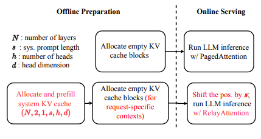

## About

A vLLM fork with RelayAttention implemented. See the paper for details: [RelayAttention for Efficient Large Language Model Serving with Long System Prompts](https://arxiv.org/abs/2402.14808)

- forked from vllm v0.2.6
- used to produce ALL tables and figures in the paper.
- including not only the implementation of the idea, but also those scripts for data collection and plotting.

## How to use

1. Follow the [vLLM documentation](https://docs.vllm.ai/en/latest/getting_started/installation.html#build-from-source) to install from source. See also [_scripts/install.sh](_scripts/install.sh).
2. Check the scripts [here](_scripts) to reproduce the experiments and collect data. If you are using a slurm cluster, check the [_cluster](_cluster) directory instead.

You can use [examples/relay_inference.py](examples/relay_inference.py) as the entrance for exploration of this project. See Figure 9 in the paper for a big picture.
<p align="left">

</p>


## Citation

If you use this repo for your research, please cite our [paper](https://arxiv.org/abs/2402.14808):
```bibtex
@misc{zhu2024relayattention,
      title={RelayAttention for Efficient Large Language Model Serving with Long System Prompts}, 
      author={Lei Zhu and Xinjiang Wang and Wayne Zhang and Rynson W. H. Lau},
      year={2024},
      eprint={2402.14808},
      archivePrefix={arXiv},
      primaryClass={cs.CL}
}
```
